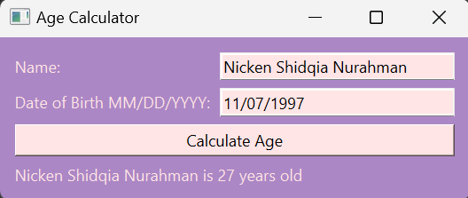

# Build Age Calculator Using Python

## Project Description

**Overview :**  
The Age Calculator is a simple PyQt6-based desktop application that allows users to input their name and date of birth, and it calculates and displays their current age in years. The application provides a user-friendly interface with input fields and a button for easy interaction.

**Challenges :**  
Build Age Calculator Using Python.

## Project Goal

The project aims to calculate user current age.

## Tools & Library Used

 &nbsp;

## Project Result

[Click here to get full code](https://github.com/nickenshidqia/Build_Age_Calculator_Using_Python/blob/8a415b6114e4bad56a26fee26bd4d62bc2673004/main.py)

### How to Use

1. Enter your name in the corresponding input field.
2. Input your date of birth in the MM/DD/YYYY format.
3. Click the "Calculate Age" button.
4. The application will display your age in years.
